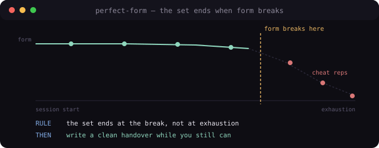

# perfect-form — stop a long AI session when form breaks, not when energy runs out

<p align="center">
  
</p>

**1** A [Claude Code](https://docs.anthropic.com) skill for long autonomous sessions: work continues to exhaustion, but never at the cost of form. When form breaks, the set ends with a clean handover — not cheat reps that become repair debt later.

**1.1** Borrowed from strength training: reps with perfect form until you cannot do another with perfect form, then stop. Extra reps bought by breaking form produce injury, not progress.

**1.2** At every "let me squeeze in one more pass," the skill runs a six-point form check (verified · receipted · logged · legible outside · fail-closed · routed) and watches for mechanical degradation signals (skipped log, bare commit, decision from memory, same error class twice, operator correcting you twice).

**2** Why: long sessions rarely fail by stopping too early. They fail by continuing with degraded form while output still flows. This skill was written after a session where discipline broke five times and **every break was caught by the human, not the system** — each a rule with nothing enforcing it.

**3** How to run

```
npx skills add yagizkaterli/perfect-form
```

Or copy `SKILL.md` into `.claude/skills/perfect-form/`. Trigger when the session is long, quota/context is thinning, a "one more pass" impulse appears, the operator asks for handoff, or the same mistake class repeats.

**4** What a run looks like

Six hours in, about to start another block:

> **form check** — logged: no · legible outside: no · verified: yes · … → two failures → **the set is over.**
> **racking:** in-flight work inventoried · decisions surfaced · handover written · committed · next session's first move already named.
> Repair: where form broke, add mechanism (e.g. a commit-msg hook), not more load.

**5** Status (honest)

- Public skill package for Claude Code — **live**, not archived.
- Solo-maintained by [yagizkaterli](https://github.com/yagizkaterli). **0 stars.** Tiny repo (skill + license).
- Not a productivity booster and not a stop-early rule. Protects the quality of the **last** rep, not the count.

**6** Related

- [foundation](https://github.com/yagizkaterli/foundation) — portable multi-agent working discipline
- [human-steps](https://github.com/yagizkaterli/human-steps) — never bury what you need from the human
- [frictionless](https://github.com/yagizkaterli/frictionless) — hand work back without handing back labour
- [idea-boost](https://github.com/yagizkaterli/idea-boost) — idea bursts, grounded and banked in one pass

## License

MIT.
